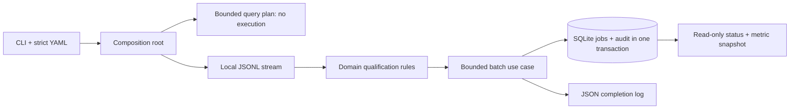
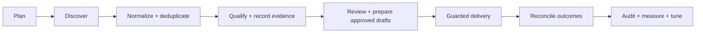

# Architecture: implemented bootstrap and extension boundaries

## Current offline flow

The domain uses the Python standard library only. Application use cases depend on
domain types and structural `Protocol` ports: `JobReader`, `JobRepository`, `Clock`,
and `Telemetry`. Only `bootstrap.py` constructs concrete adapters. An AST-based
architecture test rejects third-party/infrastructure imports in the core layers.

Python 3.14 + uv keeps the local runtime and dependency graph explicit. Pydantic
validates boundaries; PyYAML parses safe configuration. SQLite avoids a server;
structlog and Prometheus provide lightweight local diagnostics. No LLM SDK, cloud
subscription, broker, Kubernetes cluster or per-site paid API is required.

## Contracts

| Boundary | Implemented behavior |
| --- | --- |
| Configuration | Unknown keys, duplicate IDs/keys, aliases and unsafe enablement fail validation. Canonical config + catalog hash identifies the policy used by each run. |
| Sources | 27 generic entries; enabled means selected for planning, not authenticated. Native keywords and domain-scoped queries are distinct. Target-only/unavailable entries cannot be enabled yet. |
| Query plan | Role priority, source priority, normalized query deduplication and a hard output budget. DevOps precedes Full Stack AI, then the configured web/backend/serverless profiles. No query is executed. |
| Job identity | SHA-256 of canonical URL: remove common tracking parameters/default ports/fragment; preserve other query parameters. Different URLs are not fuzzily merged yet. |
| Qualification | Role/title + optional AI context, remote requirement, age, language, company exclusions and preferred keyword score. Missing evidence goes to review, not invented facts. |
| Storage | WAL, FULL synchronization, foreign keys, bounded lock wait, schema version guard. Each job change and its audit event commit atomically. |
| Telemetry | JSON completion log to stderr; transactional audit in SQLite; metrics rendered on demand. No telemetry server or external exporter. |

The source catalog stores command *references*, not executable command lines. These
are hints for a later OpenCLI capability probe, not guaranteed commands on every
installation. `web/read` reads known pages; domain-scoped discovery still needs a
search backend before a page reader can run. No per-ATS APIs are implemented.

`radar doctor` checks runtime versions/resources and optional tool presence only.
Presence does not imply a valid version, working command, login, or permission.

## Data and failure model

`runs` records run IDs, effective config hash, UTC timestamps and state.
`jobs` holds the latest payload and evaluation. `audit_events` records start,
per-job decision/outcome/hash and terminal state; it does not snapshot every prior
job description. Full provenance retention and replay are a later milestone.

Unchanged records do not rewrite job state, but each observation is audited.
Re-running valid input is idempotent for job identity, not for audit count. A job
can change evaluation when its publication age crosses a policy boundary.

Each bounded batch is committed independently. If a later line fails, earlier
batches survive and the run becomes failed. If the process is killed, or storage
is unavailable while marking failure, a run can remain running; the bootstrap
does **not** auto-resume or claim it completed. No automatic retries are performed.
Invalid input is not retried as a network fault. CLI exit codes: 2 invalid input,
3 filesystem I/O, 4 storage/runtime; `doctor` returns 1 for an unsupported runtime.

SQLite requires >= 3.51.3 as a conservative WAL baseline. The selected interpreter's
linked SQLite matters, not just the Python version. `radar doctor` exposes both.
Use a local disk; network filesystems are not a supported deployment target.

## Modular phase roadmap

Planning, local normalization/qualification, persistence, basic diagnostics and
explicit direct/assisted mail delivery are wired today. See [mail flow](mail.md).
`plan --output` also feeds opt-in `collect`: `application/collection.py` uses Reader
and ResearchCache ports; the Agent Reach adapter handles bounded subprocesses and
SQLite evidence. `mail compose` renders reviewed facts without a model. Native Gmail
reuses the gateway contract through an optional OAuth connector with batched reads.
Each future phase gets its own CLI command and use case; the
orchestrator should schedule those same use cases instead of duplicating logic in
many shell scripts. JSONL is the interchange format; SQLite stores shared durable
state. See [roadmap](roadmap.md) for acceptance gates.

Parallelism will be **bounded and adaptive**, not an unbounded process per result:
an async I/O dispatcher, per-source budgets, a small process pool only for measured
CPU bottlenecks, bounded queues/backpressure, and one SQLite writer. Browser session
locks prevent competing workers from changing the same authenticated session.
The collector now has a bounded 1–8 thread I/O pool and a single cache writer.
Adaptive resource scheduling, durable leases and live throughput benchmarks remain pending.

## Contact policy boundary

The pure `may_contact` guard blocks recent recipient OR verified-company contact
for 48 hours. Exactly 48 hours ago passes the cooldown; older mailbox history is
not a permanent duplicate. Suppression, uncertain delivery, and unverified contacts
still block it. Passing this guard neither creates nor sends a message. The separate
`DeliverBatch` flow uses fresh evidence, confirmation, transactional quota reservation
and Gmail read-back; transport is direct OAuth or the legacy authorized connector bridge.
