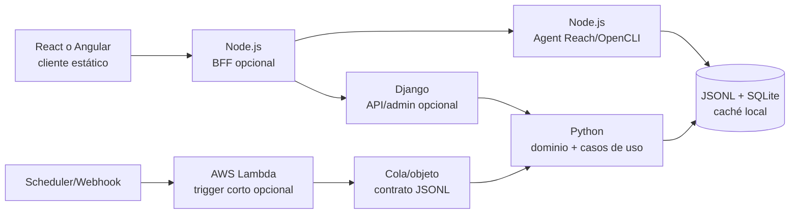

# Arquitectura poliglota sin duplicar el dominio

Esta página describe el despliegue; la ecuación de **posiciones buscadas** está en
[Configuración](configuration.md). Las tecnologías solicitadas caben en el diseño, pero no deben convertirse en siete
capas obligatorias. El núcleo determinista sigue siendo Python; las demás piezas son
adaptadores opcionales según el modo de despliegue. Así se conserva el objetivo local,
gratuito y con poco contexto.

## Ecuación propuesta



El flujo real recomendado para la primera versión es `React (opcional) → Python CLI`;
Node solo ejecuta las capacidades web que ya requieren Node. Django, BFF y Lambda se
añaden únicamente si aparece una necesidad concreta de usuarios concurrentes,
autenticación o ejecución programada. No se mantienen React **y** Angular, ni Django
**y** Node como dos backends con la misma lógica.

## Responsabilidad de cada tecnología

| Pieza | Uso correcto | Lo que no debe hacer |
| --- | --- | --- |
| Python | Dominio, filtros, deduplicación, outbox, auditoría y workers batch | Depender de framework web o modelo para decidir contactos |
| Node.js | Adaptador Agent Reach/OpenCLI, BFF fino o streaming de estado | Reimplementar reglas, cuotas o persistencia de negocio |
| Django | API de control, administración y autenticación cuando haya varios usuarios | Convertirse en segundo dominio o ejecutar envíos sin outbox |
| React | Dashboard liviano, revisión de fichas y estado de corridas | Aprobar o enviar desde el navegador |
| Angular | Alternativa de frontend para equipos que necesiten un framework más opinado | Coexistir con React para la misma pantalla |
| Lambda | Disparador idempotente de una fase corta o consumidor de cola | Crawling largo, sesión de navegador, SQLite local o reintento ciego |

### Elección de frontend

React es el valor por defecto por su superficie incremental: una pantalla estática
puede leer paquetes JSON sin añadir un servidor. Angular es una alternativa válida si
se requiere un equipo estandarizado en TypeScript, formularios complejos, guards y
convenciones de aplicación completas. La elección no cambia los puertos Python.

### Elección de backend

Python es el backend canónico de este repositorio. Django solo aporta transporte,
usuarios y panel; importa los casos de uso mediante un adaptador o los invoca por una
cola. Node puede ser un BFF para sesiones web o para el puente de herramientas, pero
debe reenviar un contrato versionado y no conocer las reglas de cualificación.

### Lambdas y coste

Lambda no es necesaria para que el programa sea gratuito: una tarea local programada
evita infraestructura, límites de proveedor y cold starts. Si más adelante se usa,
la función debe recibir un `run_id`/`task_id`, leer un objeto JSONL, llamar una sola
fase acotada y escribir un resultado idempotente. La cuenta cloud, almacenamiento,
colas y tráfico pueden tener coste; no se asume que una cuota gratuita sea permanente.
Para crawling o revisión larga se mantiene un worker local/contenerizado y Lambda
solo dispara o recoge su estado.

## Contrato entre lenguajes

El límite compartido es JSONL versionado, no objetos internos del framework:

```json
{"schema":"job-radar.run.v1","run_id":"run_123","phase":"review","idempotency_key":"review:123:7","trace_id":"local-abc"}
```

Todos los consumidores deben aceptar campos desconocidos, validar tipos y acotar
tamaño. `run_id`, fase e `idempotency_key` permiten reanudar sin duplicar; `trace_id`
une auditoría, métricas y logs. HTTP de Django/Node y eventos Lambda traducen a este
mismo contrato. Las respuestas grandes van a archivo/objeto y la interfaz recibe solo
contadores, cursores, huella y enlaces locales.

## Flujo por fases

1. Python genera el plan y persiste el cursor.
2. Node ejecuta búsquedas/lecturas permitidas con límites; guarda la evidencia en
   caché y devuelve contadores.
3. Python normaliza, cualifica y produce fichas de revisión acotadas.
4. React o Angular presenta fichas; una aprobación explícita crea el manifiesto.
5. Python prepara y envía por OAuth, con outbox y reconciliación. El frontend nunca
   llama Gmail directamente.
6. Un scheduler local, Django o Lambda puede disparar una fase, pero no salta los
   mismos controles ni crea un fallback asistido.

## Regla de complejidad

Añadir una pieza requiere medir un cuello de botella y un test de contrato. Para el
objetivo actual (local, sin APIs de IA y hasta 500 envíos en la cuota local, divididos
en lotes preparados de 100), la matriz
mínima es Python + SQLite + CLI, con Node solo donde Agent Reach lo exige. React,
Angular, Django y Lambda quedan como perfiles de presentación/operación, no como
dependencias del núcleo.
